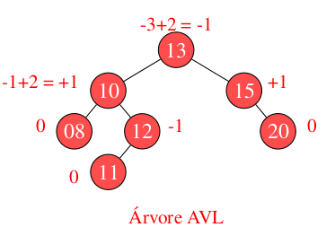
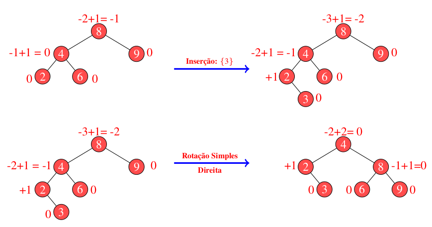
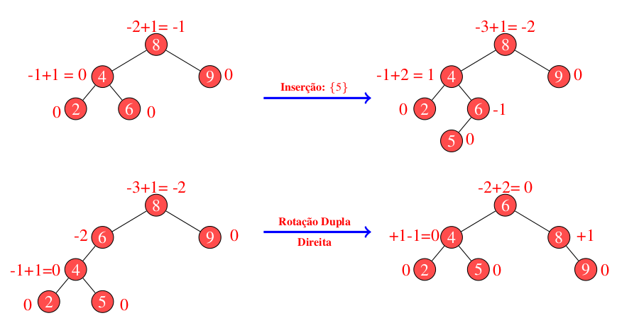

# Árvore AVL

 
 
 
 

 

 

	Em uma árvore binária do tipo AVL, os nós se mantêm aprocimadamente balanciados. Isso permite que processos de inserção, remoção e pesquisa sejam realizados sob custo computacional de O(logn).

	Para a realização dos balanceamentos, a AVL modifica o método de inserção da árvore binária, introduzindo nela um procedimento de avaliação de peso e quatro modelos de rotação.

	O fator de peso é utilizado para identificar quando a árvore se apresenta desbalanceada, para com isso identificar que tipo de rotação é preciso empregar na estrutura para que essa volta e se manter aproximadamente balanceada. A abordagem do fator de peso pode ser observada através da Fig 1. 

 
<figcaption align="center"> Fig 1. Exemplo de árvore AVL. </figcaption>

	Observe, por meio da representação da Fig 1, que os fatores de peso podem se apresentar entre -1 e +1. Isso demonstra que a árvore em questão está balanceada segundo suas regras. Para obter esse fator de peso, consideramos a avaliação do nível de altura do filho mais profundo de cada sub-árvore (i.e., esquerda e direita). Quando uma sub-árvore esquerda é avaliada, seu valor de peso se apresenta como negativo. Pelo contrário, quando a sub-árvore direita é observada, essa leva para os níveis mais acima valores positivos de altura. Então, uma árvore AVL se encontra desbalanceada se o fator de peso de um dado nó excede o limiar entre -1 e +1. Neste caso, as rotações são realizadas para retornar a estrutura à condições aceitáveis. 

	Em uma árvore AVL desbalanceada, um total de 4 rotações podem ser realizadas, duas simples e duas duplas. Considera-se rotações simples esquerda e/ou direita a movimentação da estrutura em um único processo. Essas são aplicadas sempre que o fator de peso do nó desbalanceado coincidir em sinal com a sub-árvore que levou ao desbalanceamento. Observe abaixo na Fig 2 um exemplo de rotação simples para direita. Neste, note que o sinal dos fatores de peso do nó que gerou o desbalanceamento (i.e., nó 8) e da sub-árvore causadora do mesmo (i.e., 4) são iguais. Isso caracteriza uma rotação simples para direita, uma vez que ambos os sinais são negativos, o que indica que o desbalanceamento gerado está na esquerda.   

 
<caption> Fig 2. Exemplo de rotação à direita para rebalanceameto da árvore binária.</caption> 

	Considerando ainda o exemplo da Fig 2, observe que ao produzir o rebalanceamento necessário, neste caso, obtivemos duas grandes modificações. Primeiro, como o desbalanceamento ocorreu na raiz da árvore, essa sofreu modificação, deixando de ser o nó 8 para se tornar o nó 4. Segundo, o filho direito de 4, representado pelo nó 6, deixa de conectar a ele para se tornar o filho esquerdo do nó 8. Esse segundo passo é necessário para garantir a integridade das regras básicas de uma árvore binária, a qual define a existência de apenas um filho na esquerda e um como filho direito. Então, ao imaginar a rotação é preciso observar essas peculiaridades para não errar a recomposição da estrutura. Vejamos agora como proceder sob modelos de rotação dupla. A Fig 3 detalha um exemplo para este caso. 

 
<caption> Fig 3. Exemplo de rotação dupla à direita para rebalanceameto da árvore binária.</caption> 

	Em uma rotação dupla, conforme pode ser observado na Fig 3, dois movimentos são necessários. Para detecnar a necessidade desses movimentos, basta observar o sinal atribuído ao fator de do nó desbalanceado e o da sub-árvore causadora do problema. Note que, o nó desbalanceado mais uma vez é o nó cujo valor é 8. Nesse nó temos um fator de peso de -2, o que indica um desbalanceamento de sua sub-árvore esquerda. Já em sua sub-árvore esquerda observamos um fator de peso positivo, o que indica a necessidade de rotação dupla para correção. Neste caso, primeiramente produzimos uma rotação simples na sub-árvore esquerda para igualar seu sinal de fator de peso ao sinal do nó desbalanceado. Feito isso, produzimos uma segunda rotação ao contrário para corrigir o nó sinalizado no início como desbalanceado. Note que ao produzir rotações nos filhos, valores maiores que 1 podem ser produzidos, como no caso do nó 6 que recebeu após rotação um fator de -2. Embora saibamos que esse valor indica desbalanceamento, este é ignorado, uma vez que, tal fator só foi produzido após rotação de correção. Além disso, observe que para alinhar corretamente a estrutura, os nós de valor 5 e 6 foram realinhados. Isso é preciso porque ao realizar a rotação sem o realinhamento a composição da árvore ficará errada, tendo como filho direito do nó 6 o nó cujo valor é 5. Então, ao detectar uma rotação dupla, observe se o primeiro giro fará com que a integridade da estrutura se mantenha. Caso contrário, faça primeiro o alinhamento conforme demonstrado no exemplo, depois gire a estrutura.  

	Segundo a representação da Fig 3, ao detectar o desbalanceamento, foi identificado a necessidade de uma rotação dupla para a direita. Isso é confirmado observando o sinal do nó desbalanceado, no caso o nó 8. Neste, o fator de desbalanceamento é negativo, o que indica a necessidade de rotação para a direita. Já no filho, o fator é positivo, o que confirma a necessidade de ser uma rotação dupla, devido a incompatibilidade de sinal com o nó 8. Dessa forma, podemos concluir que, uma rotação dupla para direita e/ou esquerda é composta de duas rotações simples. A primeira, feita na sub-árvore, é realizada sempre para o contrário da rotação identificada, ou seja, para uma rotação dupla direita, rodamos a sub-árvore para esquerda e vice versa. Então, o título da rotação se dá pelo fator que produziu o desbalanceamento na hora de uma inserção ou remoção. 

# Compilação e Execução

A estrutura árvore disponibilizada possui um arquivo Makefile que realiza todo o procedimento de compilação e execução. Para tanto, temos as seguintes diretrizes de execução:

| Comando                |  Função                                                                                           |                     
| -----------------------| ------------------------------------------------------------------------------------------------- |
|  `make clean`          | Apaga a última compilação realizada contida na pasta build                                        |
|  `make`                | Executa a compilação do programa utilizando o gcc, e o resultado vai para a pasta build           |
|  `make run`            | Executa o programa da pasta build após a realização da compilação                                 |

# Contatos

 

<a style="color:black" href="mailto:michel@cefetmg.br?subject=[GitHub]%20Source%20Dynamic%20Lists">
✉️ <i>michel@cefetmg.br</i>
</a>

